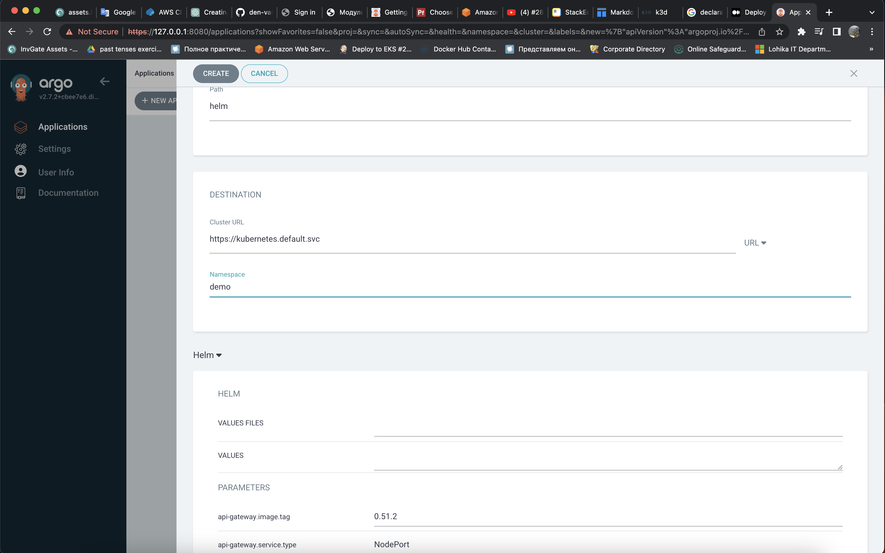
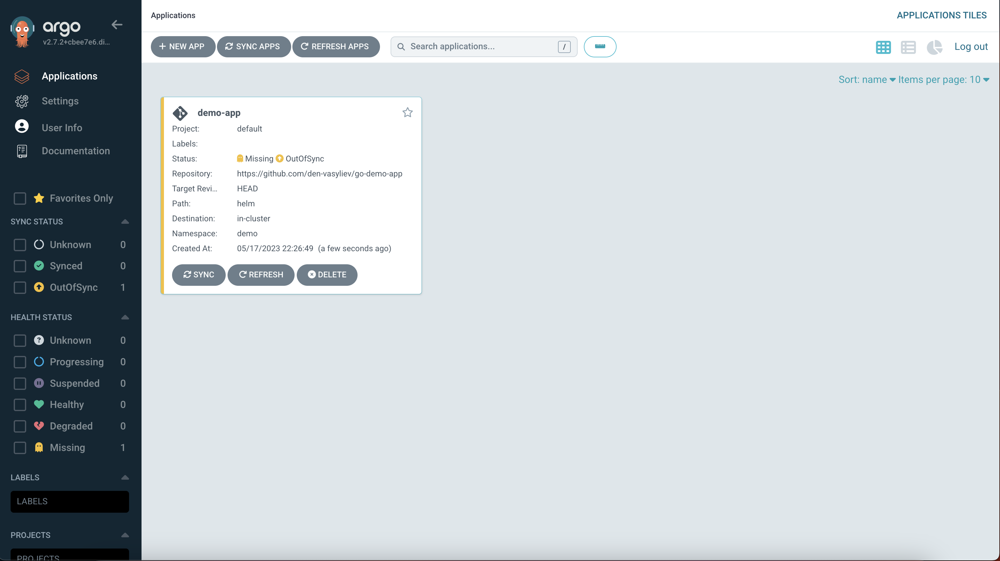

# Deploying Applications with ArgoCD

Argo CD is an open-source, declarative continuous delivery (CD) tool for Kubernetes. It enables GitOps practices by automating the deployment and lifecycle management of applications in a Kubernetes cluster.
With Argo CD, you can define the desired state of your applications in Git repositories using declarative YAML manifests. Argo CD continuously monitors these repositories, detects changes, and reconciles the actual state of the cluster with the desired state defined in Git.

## Setting Up ArgoCD

1.  Install Argo CD
	```
	kubectl create namespace argocd 
	kubectl apply -n argocd -f https://raw.githubusercontent.com/argoproj/argo-cd/stable/manifests/install.yaml
	```
2. Kubectl port-forwarding can also be used to connect to the API server without exposing the service.</br>
	`kubectl port-forward svc/argocd-server -n argocd 8080:443`
3. Login to Argo CD web UI:
	```
	username: admin
	password: kubectl -n argocd get secret argocd-initial-admin-secret -o jsonpath="{.data.password}" |base64 -d; echo
	```
Once we log in successfully we can see the below home page.
	

## Deploying application with Argo CD using console
-  Log in to the console and click “NEW APP” and it will open the configuration window of the application.

- Provide the application name, and project name as default and enable AUTO-CREATE NAMESPACE under sync options (argocd will create a namespace if it is not present).

- Provide the source code repository URL under the source section which contains your manifest files under the source section, provide the branch name and path of the files if you have Manifest files inside the folder in the repository.

- Provide the cluster details under the destination section. Just enter the *https://kubernetes.default.svc* It will install the application in the same cluster as argocd. 

- You also can use YAML file for creation app:
  ```
  apiVersion: argoproj.io/v1alpha1
  kind: Application
  metadata:
    name: demo-app
  spec:
    destination:
      server: https://kubernetes.default.svc
      namespace: default
    source:
      repoURL: https://github.com/den-vasyliev/go-demo-app
      targetRevision: HEAD
      path: helm
    project: default
    syncPolicy:
      automated:
        prune: true
        selfHeal: true
      syncOptions:
      - CreateNamespace=true  
  ```
- We will be able to see our application on the Homepage. Now we should click sync to get the files from our repository 

- It will display the sync configuration. If you want to change branch name or enable AUTOCREATE NAMESPACE. We can do modifications and click the synchronize at the top of the UI.

- Now it will sync the files from the git repo and install the manifest files into the cluster.

- If we open the application, It will display the entire Hierarchy of the application as below.


- We can fetch the application details via kubectl as well

- If we have done any changes to the manifest files in the repo. Argocd will not fetch the updated files automatically. So we need to enable the auto-sync option. Once it is enabled, Argocd will check the repo every 3 mins.
- Open the respective application. Click the App details and click Edit in the right corner.
 
-   We will be able to see the below info under the SYNC POLICY section.

-   We should ENABLE AUTO-SYNC. So argocd will look at the repo for any changes in files every 3 Minutes. We should also enable PRUNE RESOURCES (If the resource is no longer mentioned in the manifest files, it will delete those resources automatically).
-   Enable SELF HEAL (If someone modified the cluster manually. It will automatically trigger the argocd to roll back the changes to the desired state as per the manifest files in the repo configuration).

## Conclusion
We have covered How to install the Kubernetes application using Argo CD console
