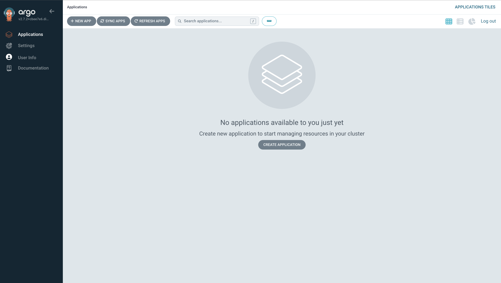

# Installing the system and configuring access to the ArgoCD GUI

## Requirements
- Make sure you have a Kubernetes cluster [**k3d**](https://k3d.io/v5.4.9/) installed and connected to it. If you don't have installed k3d, you can install him from official k3d page

## Installation
1. Create new cluster:
	`k3d cluster create argo`
2. Wait for creation of the cluster and chech cluster info:
	`kubectl cluster-info`
3. For our convenience make an alias for *kubectl*:
	`alias k=kubectl`
4. Check all created resources in our new cluster *argo*
	`k get all -A`
5. Install Argo CD:
	`kubectl create namespace argocd 
	kubectl apply -n argocd -f https://raw.githubusercontent.com/argoproj/argo-cd/stable/manifests/install.yaml`
This will create a new namespace, `argocd`, where Argo CD services and application resources will live.
6. Check all created resources:
	`k get all -A -n argocd`
7. To access the ArgoCD web interface, run the following command to expose the service:
	`k port-forward svc/argocd-server -n argocd 8080:443`	 			
8.  Open a web browser and navigate to  `https://localhost:8080`. You should be able to access the ArgoCD UI.
9. For access to application, you need to get password for *admin* user:
	`k -n argocd get secret argocd-initial-admin-secret -o jsonpath="{data.password}" |base64 -d; echo` 	

## Access to Argo CD Web interface 
1. Open your browser and go to Argo CD URL.
2. On "Login Screen", please enter your credentials(login and generated password).
3. You will be redirected to main page - Dashboard, where you can view the status of your applications and repositories, as well as manage your clusters, settings, and user accounts., view all details, view its current state, configuration, and deployment history.
4. All changes you can made from this Web interface.
5. You can refer to the ArgoCD documentation, if you have any questions.

https://asciinema.org/a/585333

